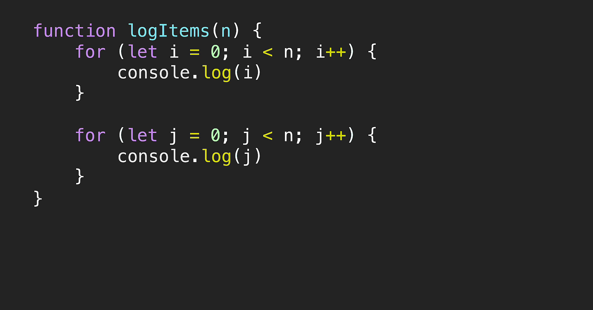
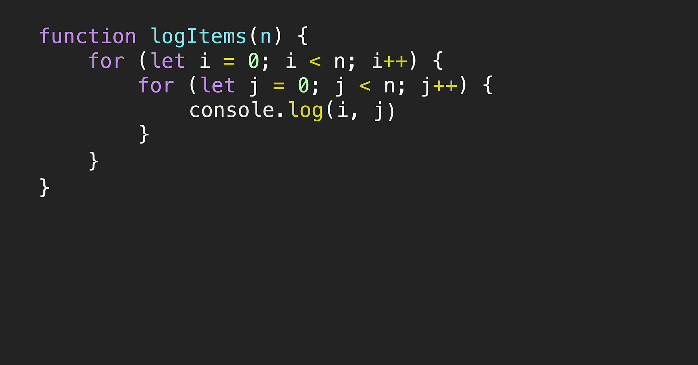
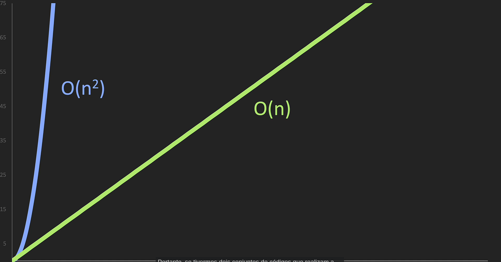
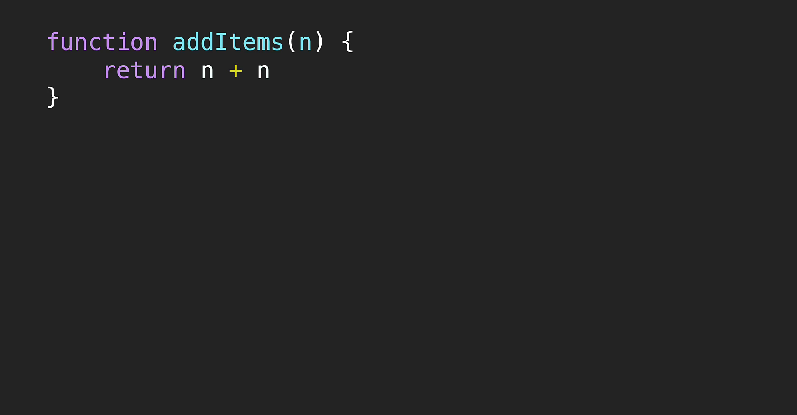
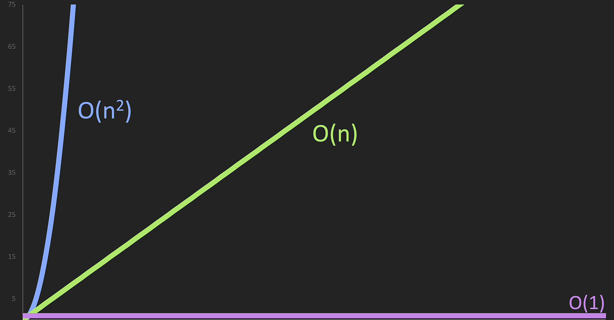
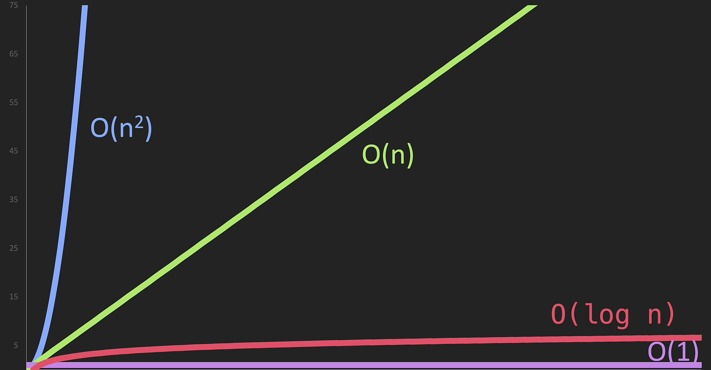

# BIG O Notation
Considerada uma notação para medirmos qual é a velocidade e memória que um determinado algoritmo leva para concluir uma tarefa. Entretando, atuamos com 2 tipos de complexidade: A **espacial** e a de **tempo**. A temporal mede quantos passos um determinado algoritmo precisa para concluir a tarefa, já a espacial mede quando de memória foi utilizado.

## O(n) | Linear ou Proporcional
O(n) tem como significado o caso linear ou proporcional, onde o número de execuções sempre será n vezes. O(n) não considera as constantes, **Drop Constants**!

## _O(n²)_ | Quadrática ou Polinomial
_O(n²)_ tem como significado o caso quadrático ou polinomial onde a base é o tamanho do problema e o expoente é fixo. Se tenho um loop for aninhado isso significa que se tiver 10 valores terei que percorrer 10*10, logo 100 operações necessárias.

## _O(1)_ | Constante
_O(1)_ tem como significado o caso constante, onde 1 representa um valor que não sofre alteração com o passar das execuções.

## _O(log n)_
_O(log n)_ tem como significado o caso logarítimico, onde o número de operações é considerado log n. Em um cenário onde preciso fazer um pesquisa binária em um array ordenado o pior case será log n, então se tenho 16 items o valor será log 16 na base 2 é equivalente a 4, logo meu pior caso será 4 operações.
